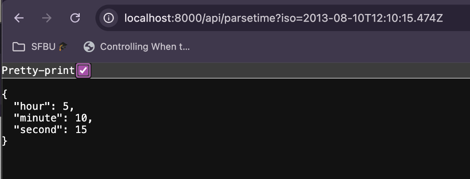
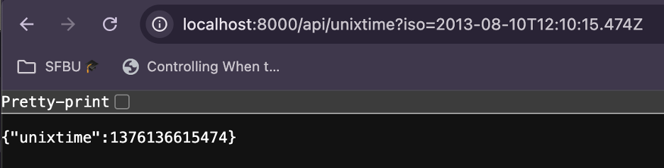
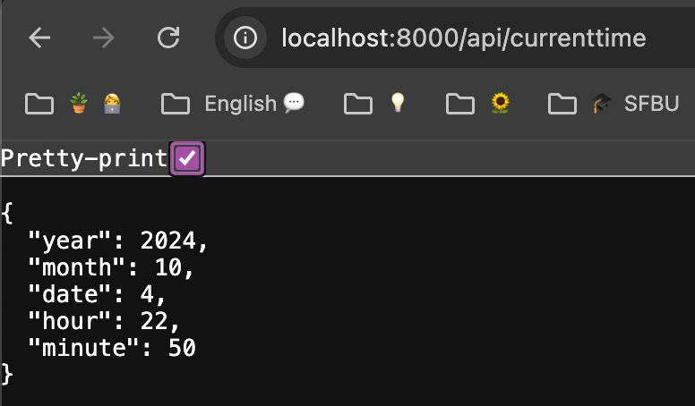

# TimeServerPractice

1. Project Title:
HTTP JSON API Time Server

2. Description:
A simple Node.js-based server that returns the current time in various formats, including:

- Plain text formatted time.
- JSON with hours, minutes, and seconds.
- UNIX epoch time.

3. Set up the environment:
Install Node.js on macOS: Follow the Node.js installation guide for macOS.
To check the installed Node.js and npm version.
Run the command:
node -v
npm -v

4. Download Programs and Documentation:
    - Download Node.js from the official website.
    - Make sure the http and url modules are available in your Node.js environment (built-in modules).

5. Process of Program Execution:
    1. Clone the repository: git clone https://github.com/YinYinPhyo/TimeServerPractice.git
    2. Navigate to the project folder: cd your-project-folder
    3. Run the time server: node filename.js port-number 
        Example: node time_server.js 3000
    4. Access the endpoints:
        http://localhost:port/api/parsetime?iso=<time>
        http://localhost:port/api/unixtime?iso=<time>
        http://localhost:port/api/currenttime

6. Execution Screenshots:
Include screenshots that show the outputs of the server.
Example screenshots:

